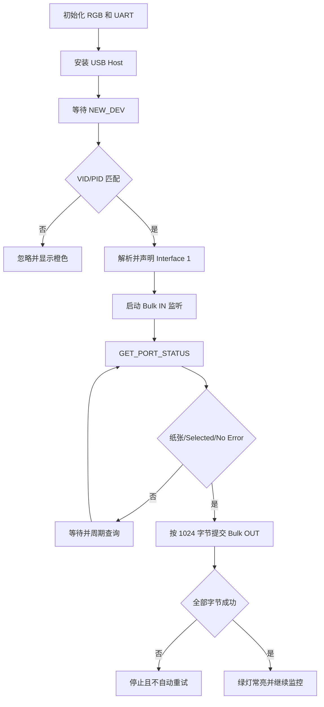

# ESP32-S3 通过 USB 向 HP DeskJet 2300 发送 PRN 的方案设计

## 1. 目标与边界

服务器使用目标打印机的 Windows 驱动生成原始 `.prn` 文件。ESP32-S3 不解析、
排版或重新生成文档，只负责保存或接收 PRN，并把字节原样发送给打印机。

同一个 PRN 已经通过网络 TCP 9100 端口验证可以正常打印，说明它是打印机可接受
的 PDL 数据。USB 方案需要把相同数据送入 USB Printer Class 的 Bulk OUT 端点。

当前程序把 `1.prn` 编译进固件，适合验证 USB 链路。产品化时可以把数据来源换成
HTTP 下载、MQTT 后的文件、SD 卡或 Flash 分区，USB 发送层保持不变。

## 2. 已识别的 USB 参数

| 项目 | 实测值 |
|---|---|
| VID:PID | `03f0:3654` |
| 产品 | HP DeskJet 2300 series |
| USB 速度 | Full-Speed |
| 配置 | Configuration 1 |
| 打印接口 | Interface 1, Alternate 0 |
| Class/Subclass/Protocol | `07/01/02`，双向 Printer Class |
| 打印数据端点 | Bulk OUT `0x08`，MPS 64 |
| 返回数据端点 | Bulk IN `0x89`，MPS 64 |

端点地址应从配置描述符解析并验证，不能只依赖硬编码值。

## 3. 硬件与安全供电

### 3.1 信号连接

```text
ESP32-S3 原生 USB                 打印机 USB-B
GPIO20 / USB D+  --------------> Pin 3 / D+
GPIO19 / USB D-  --------------> Pin 2 / D-
GND              --------------> Pin 4 / GND
受保护的 5V VBUS --------------> Pin 1 / VBUS
```

D+ 与 D−已经通过连续性测试及实际枚举验证，不应交换。USB 数据对需要保持短、
等长并绞合，避免长飞线、松散焊点及过长屏蔽层引线。

### 3.2 VBUS

打印机 USB-B 口是 USB Device 端，需要 Host 在 VBUS 上提供约 5V，供打印机检测
主机连接。VBUS 不负责打印机主体供电，打印机仍使用自己的电源。

开发板 COM 口给 ESP32 供电不代表原生 USB Host 口一定输出 VBUS。本板实测没有
提供 VBUS，所以测试时使用充电宝提供 5V，并让 ESP32、VBUS 与打印机共地。

产品硬件应使用带限流、短路保护和反向电流阻断的 USB 电源开关芯片，由 ESP32
控制 VBUS。不要直接并联电脑、扩展坞和充电宝等多个 5V 输出，也不要把裸线接入
笔记本 USB-C 供电路径。实验中曾因不安全并联触发笔记本 USB-C 端口保护。

### 3.3 调试串口

原生 USB 被 Host 占用后，日志使用 UART0：

```text
ESP32-S3 GPIO43 TX  ---> USB-TTL RX
ESP32-S3 GND        ---> USB-TTL GND
```

USB-TTL 必须使用 3.3V 逻辑。只读日志不需要连接转换器 TX、5V 或 3.3V。串口参数
为 115200、8N1、无流控。打开带 DTR/RTS 的串口可能复位板子并再次打印。

## 4. ESP-IDF 开发思路

### 4.1 最小枚举诊断

开发阶段先编写最小诊断固件，只安装 USB Host、注册异步客户端并打印描述符。
它不声明打印接口、
不发送作业。流程如下：

1. `usb_host_install()` 初始化 ESP32-S3 内部 USB PHY；
2. `usb_host_client_register()` 注册客户端；
3. 独立任务调用 `usb_host_lib_handle_events()`；
4. 主任务调用 `usb_host_client_handle_events()`；
5. 收到 `NEW_DEV` 后读取 Device 和 Configuration Descriptor；
6. 确认 VID/PID、接口类别和 Bulk 端点。

实测提供 VBUS 后枚举完整通过。此前只能等待设备的原因是 VBUS 缺失，不是开发
框架差异，也不是 D+/D−接反。

### 4.2 打印程序结构

最终程序位于 `hp2300_print_idf/main/hp2300_print.c`：



端点 MPS 是 64 字节，但应用可提交 1024 字节缓冲区，Host 栈负责拆分 USB
transaction。最后一块严格使用剩余长度，不补零、不追加指令。

程序每次启动只发送一次。断线、控制请求超时、Bulk OUT 超时或短传输后停止，
避免在无法确认已接收字节数时重试造成重复页。

### 4.3 打印机状态

USB Printer Class `GET_PORT_STATUS` 返回一个字节：

| 位 | 名称 | 1 的含义 |
|---|---|---|
| bit 5 | Paper Empty | 缺纸 |
| bit 4 | Select | Selected/在线 |
| bit 3 | Not Error | 未报告错误 |

实测 `0x18` 表示未报告缺纸、Selected、未报告错误。Selected 不是“被 ESP32
独占”，也不表示正在打印或已经出纸。规范允许无法准确判断的设备返回这种良性
状态，所以它只能用于基本就绪判断。

标准请求不提供寿命页数。需要计数时可以在 NVS 中累计成功作业、解析已知 PCL3
估算逻辑页数、用 `GET_DEVICE_ID` 检查 PML/MLC，或者对支持 SNMP 的网络打印机
查询 Printer MIB `prtMarkerLifeCount`。成功提交作业不能严格等同于机械完成页数。

## 5. PRN 文件处理

- 使用目标型号和正确驱动设置生成；
- 二进制方式传输，保持全部字节和顺序；
- 不做换行转换，不裁剪开头的零字节；
- 用长度和 SHA-256 检查各阶段文件一致性。

PRN 可能含文档内容、用户名、作业名称、时间戳和账户信息，因此仓库排除全部
`.prn`。使用者应自行把文件放到 `hp2300_print_idf/main/1.prn` 后构建。

## 6. RGB 状态（GPIO48）

| 显示 | 含义 |
|---|---|
| 红色闪 1 次 | 等待 USB |
| 青色闪 2 次 | 打开和检查打印机 |
| 黄色闪 3 次 | 打印机未就绪 |
| 蓝色闪 4 次 | 正在发送 |
| 紫色闪 5 次 | 状态不可用 |
| 红色闪 6 次 | 打印机断开 |
| 红色闪 7 次 | 致命错误或超时 |
| 橙色闪 8 次 | 非目标设备 |
| 绿色常亮 | USB 已接收全部文件字节 |

绿色常亮不代表机械打印完成。

## 7. 构建、烧录与验证

```powershell
Copy-Item C:\path\to\job.prn hp2300_print_idf\main\1.prn
cd hp2300_print_idf
.\build_flash.ps1 -BuildOnly
.\build_flash.ps1 -Port COM8
```

首次构建会获取 `espressif/usb` 和 `espressif/led_strip`。烧录前关闭占用 COM8
的软件。成功日志的关键行：

```text
Device address=1 VID=03f0 PID=3654
Interface=1 alt=0 OUT=0x08 MPS=64 IN=0x89 MPS=64
STATUS raw=0x18 paper_empty=NO selected=YES error=NO
USB accepted 12627/12627 bytes
All bytes delivered to USB
```

本次测试使用 ESP32-S3 revision v0.2 和 ESP-IDF v6.1。12,627 字节全部交付，
打印前后持续返回 `0x18`，打印机实际正常出纸。

## 8. 参考资料

- [Espressif USB Host API](https://docs.espressif.com/projects/esp-idf/en/latest/esp32s3/api-reference/peripherals/usb_host.html)
- [USB Printer Class 1.1](https://www.usb.org/sites/default/files/usbprint11a021811.pdf)
- [IETF RFC 3805 Printer MIB v2](https://datatracker.ietf.org/doc/rfc3805/)
